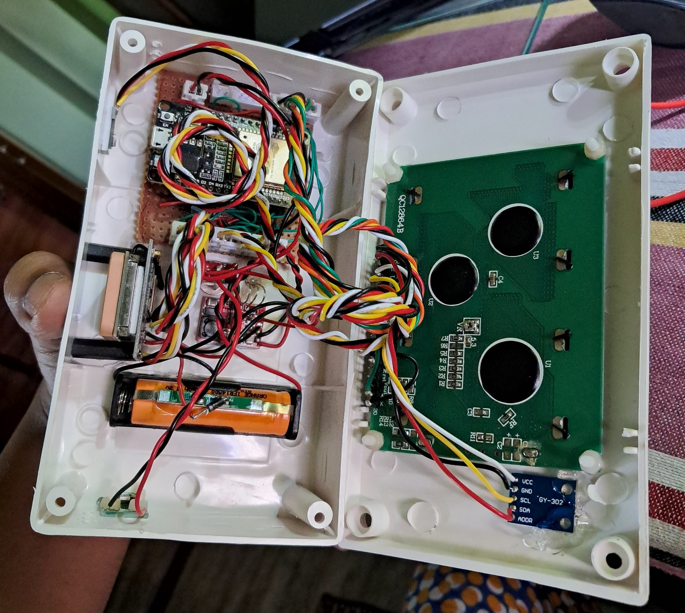
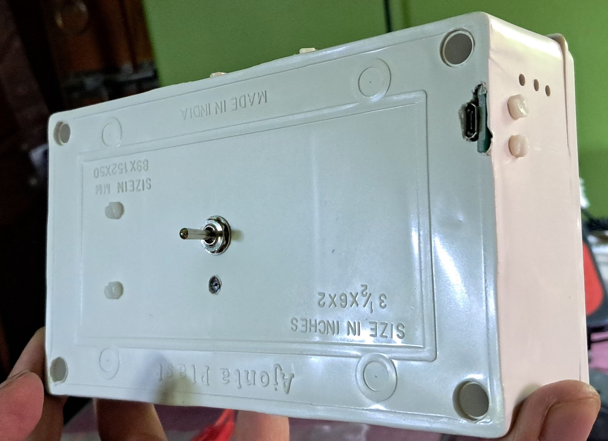
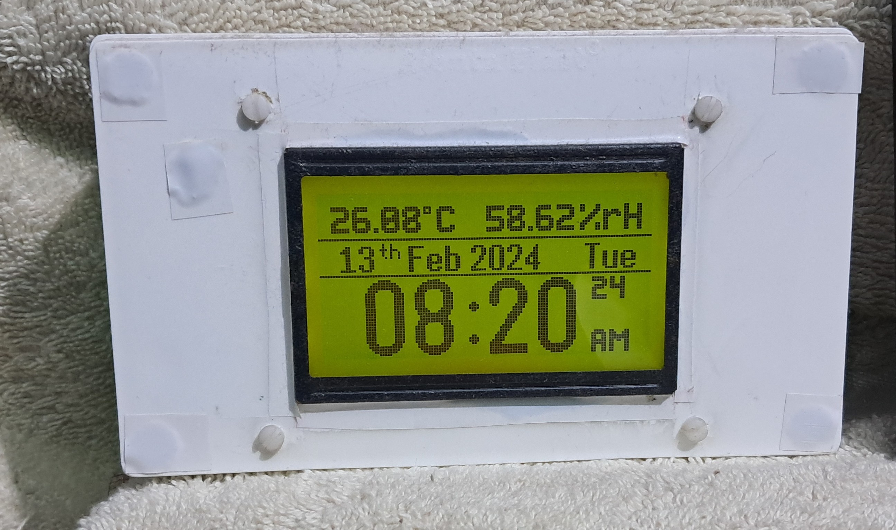
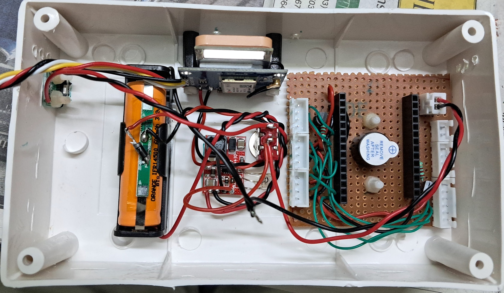

  <h1>🌍 ESP32 GPS Clock & Weather Station</h1>
  

    
    
    
  

  

    
    
    
  

  
<em>A smart clock that syncs with GPS satellites and monitors environmental conditions! 🛰️</em>

---

<h2>✨ Features</h2>
<table>
  <tr>
    <td>🕒 Time</td>
    <td>GPS-synchronized precise timekeeping</td>
  </tr>
  <tr>
    <td>🌡️ Environment</td>
    <td>Temperature & humidity monitoring</td>
  </tr>
  <tr>
    <td>🔆 Display</td>
    <td>Auto-brightness & power saving</td>
  </tr>
  <tr>
    <td>📱 Connectivity</td>
    <td>WiFi with OTA updates</td>
  </tr>
</table>

<h2>🛠️ Hardware Requirements</h2>

<strong>Core Components 📋</strong>

| Component | Purpose | Notes |
|-----------|---------|--------|
| ESP32 devkit v1 | 🧠 Controller | DOIT version recommended |
| BH1750 | 💡 Light sensor | I²C interface |
| BME280 | 🌡️ Environment | Temperature/Humidity |
| GPS Neo 6m | 📡 GPS receiver | UART interface |
| ST7920 LCD | 🖥️ Display | 128x64 pixels |
| Buzzer | 🔊 Alerts | Active buzzer |

<strong>Optional Components 🔧</strong>

- 🔋 LiFePO4 AAA 80mAh (GPS backup)
- ⚡ TP5000 charging circuit
- 🔌 BMS with IN4007 diode
- 🛠️ Prototyping materials

<h2>⚠️ Important Notice</h2>

  <strong>❌ DO NOT USE AHT25 SENSOR!</strong> 
  Due to significant accuracy issues, we recommend using BME280/BMP280/TMP117 instead.

<h2>📝 Important Notes</h2>

<strong>🔋 GPS Battery Modification</strong>

  <h4>⚠️ Known Issue with GPS Module's Internal Battery</h4>
  

    The NEO-6M GPS modules often come with problematic internal rechargeable batteries that:
    <ul>
      <li>Are frequently dead on arrival</li>
      <li>Fail to hold charge properly</li>
      <li>Only last 15-20 minutes when disconnected</li>
      <li>Cannot be reliably recharged</li>
    </ul>
  

  <h4>🛠️ Solution Implemented</h4>
  

    To resolve this, I've made the following modifications:
    <ul>
      <li>Removed the internal battery and charging diode</li>
      <li>Installed a LiFePO4 battery (AAA size)</li>
      <li>Added TP5000 charging circuit for reliable charging</li>
      <li>Implemented BMS for deep discharge protection</li>
      <li>Added diode to drop voltage to 3V for GPS backup pin</li>
    </ul>
  

  <h4>💡 User Options</h4>
  

    <strong>You have two choices:</strong>
    <ol>
      <li><strong>Keep Original Battery:</strong> 
        <ul>
          <li>Suitable if clock remains powered most of the time</li>
          <li>No modifications needed</li>
        </ul>
      </li>
      <li><strong>Modify Battery (Recommended):</strong>
        <ul>
          <li>Better for frequent power cycles</li>
          <li>Eliminates 5-10 minute GPS lock delay on cold starts</li>
          <li>More reliable long-term solution</li>
        </ul>
      </li>
    </ol>
  

<h2>📊 Schematics</h2>

    <strong>👀 Circuit Diagram</strong>
     
    
    
<em>ESP32 GPS Clock Circuit Diagram</em>

  <table>
    <tr>
      <td>📝 Format</td>
      <td>High-resolution PNG</td>
    </tr>
    <tr>
      <td>🔍 Zoom</td>
      <td>Click image to enlarge</td>
    </tr>
    <tr>
      <td>💾 Download</td>
      <td><a href="https://github.com/KamadoTanjiro-beep/ESP32-GPS-CLOCK-V1/blob/main/resources/schematic/Schematic_GPSClock-V1.png">Full Resolution</a></td>
    </tr>
  </table>

<h2>📸 Gallery</h2>

  <table>
    <tr>
      <!-- First Row -->
      <td width="33%">
        
        
<em>Internal Components 🔧</em>

      </td>
      <td width="33%">
        
        
<em>PVC Case 🎨</em>

      </td>
      <td width="33%">
        
        
<em>Front View 📱</em>

      </td>
    </tr>
    <tr>
      <!-- Second Row -->
      <td width="33%">
        
        
<em>PCB Layout 🔌</em>

      </td>
      <td width="33%">
        
        
<em>Internal View 2 🔌</em>

      </td>
      <td width="33%"></td>
    </tr>
  </table>

<h2>📜 License</h2>

<h3>GNU General Public License v3.0</h3>

<h4>✅ Permissions</h4>
<ul>
  <li>Commercial use</li>
  <li>Modification</li>
  <li>Distribution</li>
  <li>Patent use</li>
  <li>Private use</li>
</ul>

<h4>⚠️ Conditions</h4>
<ul>
  <li><strong>License and copyright notice:</strong> Include the original license and copyright</li>
  <li><strong>State changes:</strong> Document all modifications</li>
  <li><strong>Disclose source:</strong> Make source code available</li>
  <li><strong>Same license:</strong> Use the same license for derivatives</li>
</ul>

<h4>❌ Limitations</h4>
<ul>
  <li>No liability</li>
  <li>No warranty</li>
</ul>

<h2>🤝 Contributing</h2>

  <table>
    <tr>
      <td>🍴 Fork</td>
      <td>🔧 Code</td>
      <td>📤 Push</td>
      <td>📫 PR</td>
    </tr>
  </table>

<h2>📞 Support</h2>

  
If this project helps you, please consider:

  

    ⭐ Giving it a star 
    🐛 Reporting issues 
    💡 Suggesting improvements 
    🤝 Contributing code
  

---

  Built with ❤️

